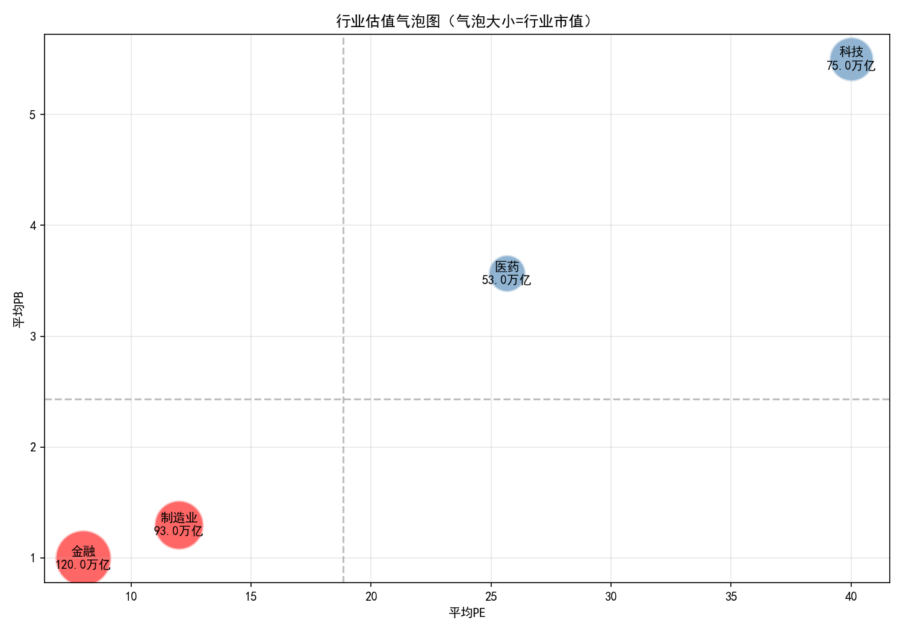

# 数据分析（⾏业基本⾯对⽐分析）

## 数据来源
- 证监会行业分类标准
- 测试数据：12家上市公司（金融、医药、科技、制造业）

## 分析内容

### 1. 行业平均估值
| 行业 | 平均PE | 平均PB | 总市值(万元) |
|------|--------|--------|-------------|
| 金融 | 8.0 | 1.0 | 1,200,000 |
| 制造业 | 12.0 | 1.3 | 930,000 |
| 科技 | 40.0 | 5.5 | 750,000 |
| 医药 | 25.7 | 3.6 | 530,000 |

### 2. 估值洼地识别
- **判定标准**：PE < 中位数(18.83) 且 PB < 中位数(2.43)
- **结果**：金融、制造业

### 3. 气泡图
- X轴：平均PE
- Y轴：平均PB  
- 气泡大小：行业总市值

